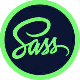

<table>
  <tr>
    <td width="50%"> <!-- El 50% es solo un ejemplo, puedes ajustar el ancho según tus necesidades -->
      <h1>Fundamentos de Sass: Crea tu Primera Landing Page</h1>
    </td>
    <td width="50%">
      

        
      

    </td>
  </tr>
</table>

Proyecto del curso de "Fundamentos de Sass: Crea tu Primera Landing Page" de Platzi 

[Aquí](https://platzi.com/cursos/sass/) puedes ver el curso.

[Puedes ver el proyecto en Figma aquí](https://www.figma.com/file/RFHdu5JEgz2PsroUVJii1c/Eco-Store-Mockups-(Copy)-(Copy)?node-id=32%3A1592&mode=dev)
